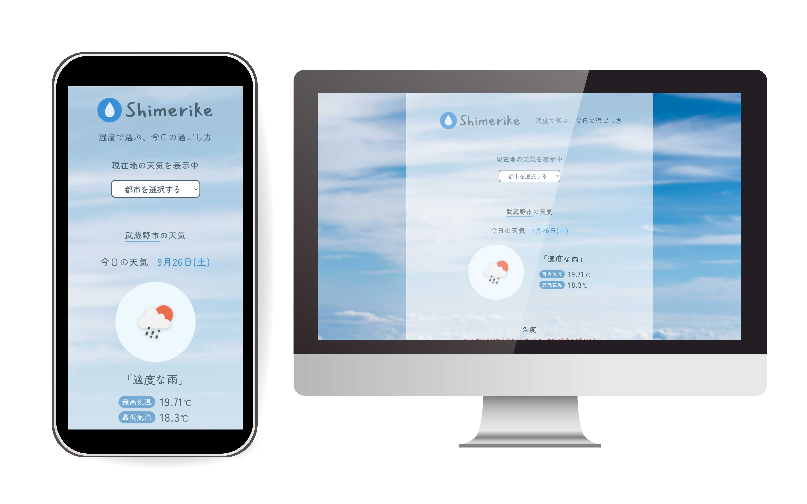

# Shimerike
#### 湿度で選ぶ、今日の過ごし方
現在地や選択した都市の天気情報を取得し、湿度に応じて「加湿」「除湿」などの過ごし方を提案するWebアプリです。

## デモ
https://min3na.github.io/works/Shimerike/
## 制作年
2026年
## 特徴
- 現在地から天気情報を取得
- 都市を選択して天気情報を表示
- 現在の天気・湿度を表示
- 今日の最高気温・最低気温を表示
- 湿度に応じて、加湿・除湿の目安を表示
- 湿度に合わせてメッセージやイラストを切り替え
## 使用技術
- HTML
- CSS
- JavaScript
- OpenWeatherMap API
- Cloudflare Workers
## API
天気情報の取得には OpenWeather API を使用しています。
APIキーはGitHub上に公開せず、Cloudflare Workersを経由してAPIを取得する構成にしています。
## 制作目的
JavaScriptの学習を兼ねて、APIから取得したデータを使ったDOM操作や条件分岐、現在地の取得などを実装しています。

