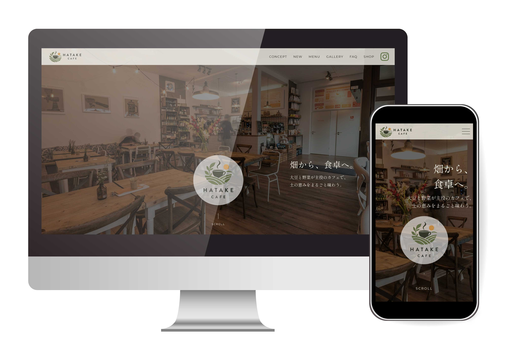

# HATAKE CAFE
植物性素材のみを使用した架空のカフェのWebサイトです。

## デモ
https://min3na.github.io/works/hatake-cafe/
## 制作年
2026年
## 使用技術
- HTML
- CSS
- JavaScript
## 制作工程
1. 要件定義・ワイヤーフレームをAIで作成
[claudeによる要件書](hatake-cafe-requirements.md)
[FigmaによるWF](img/figma_wf.jpg)
2. 要件書のデザインコンセプトをもとにロゴ・配色を決定
3. HTML/CSSによるコーディング（レスポンシブ対応）
4. JavaScriptによるインタラクションを実装
## JavaScript
JavaScriptを使用して、ユーザーの操作に応じたインタラクティブなUIを実装しました。
- ハンバーガーメニューの開閉
- ページ内リンクのスムーズスクロール
- メニュータブの切り替え
- FAQアコーディオンの開閉
- 商品画像の切り替え
- 画面幅に応じた要素の並び替え
- スクロールに応じたヘッダーの表示切り替え
- Intersection Observer APIを使用したスクロール時のフェードイン表示
## 制作目的
コーディングとJavaScriptの学習に重点を置くため、要件定義やデザインの検討にはAIを活用しました。
ロゴや配色は要件書で設定したデザインコンセプトをもとに制作し、使用する画像はPhotoshopでトリミング・調整しました。
JavaScriptでは、DOM操作やイベント処理、レスポンシブ対応、Intersection Observer APIなどを実際のWebサイトに組み込み、動きのあるUIの実装を学習しました。
