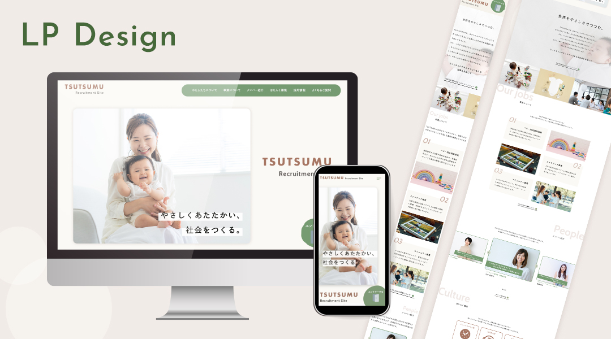

# TSUTSUMU
スクール課題として制作した、 架空のベビー用品開発企業「TSUTSUMU」の採用サイトです。

## デモ
https://min3na.github.io/works/tsutsumu/
## 制作年
2024年
## 使用技術
- HTML
- CSS
- jQuery
## 制作工程
1. 要件定義：ターゲット・目的の整理、ペルソナ、ユーザーストーリーの作成
2. ワイヤーフレームの作成
3. ムードボード・スタイルガイドの作成
4. デザインカンプの作成
5. HTML/CSSによるコーディング（レスポンシブ対応）
6. jQueryを使用したインタラクションの実装
## 制作目的
Webサイト制作の一連の工程を経験することを目的に、要件定義からワイヤーフレーム、デザイン、コーディング、インタラクションの実装まで一通り制作しました。
レスポンシブ対応やjQueryの実装では、調べながら試行錯誤し、必要に応じて講師に質問することで、一つひとつ課題を解決しながら完成させました。
## 制作のポイント
### ファーストビューの演出
企業の事業内容や世界観を伝えるため、複数の写真をフェードとズームで切り替えるスライドショーを実装しました。jQueryプラグイン「slick」を使用しています。
### メンバー紹介のスライダー
求職者が実際に働く人をイメージできるよう、メンバー紹介には自動で切り替わるスライダーを実装しました。
### CTAのインタラクション
企業のミッションを伝え、エントリーにつなげるCTAセクションでは、画像にホバーすると明るくなるインタラクションを実装しました。
### 固定エントリーボタン
ページ内のエントリー導線を目立たせるため、固定表示のエントリーボタンに流体シェイプのアニメーションを実装しました。
### カラーデザイン
性別を限定しない採用サイトを意識し、特定の性別を連想させにくいグリーンをメインカラーとして採用しました。

